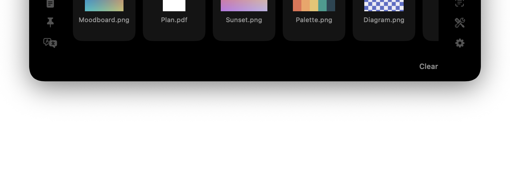

# Cyclop

*English · [Русский](README.ru.md)*

The MacBook notch as a working tool. A native SwiftUI/AppKit app: invisible at
rest, and on hover it unfolds downwards into a panel with a player, a shelf for
files and clipboard history.

[](https://github.com/akalikbergenov/cyclop/actions/workflows/build.yml)
[](https://buymeacoffee.com/akalikbergenov)



**[Download the latest version](https://github.com/akalikbergenov/cyclop/releases/latest)** —
macOS 15 or newer. Signed and notarised, so it opens on the first try.

```
0.0 % CPU at rest  ·  ≈40 MB + 14 MB helper  ·  3.7 MB bundle  ·  nothing asked at launch
```

The track in the screenshot is playing in a browser tab — Cyclop reads it from
macOS itself, with no permissions and nothing to configure in the browser. How
that works is below.

## What it does

| Tab | What it does |
|---|---|
| **Music** | Artwork, track, artist, a scrubber that seeks, prev / play-pause / next. The source is **anything**: a player, a browser tab, any app macOS itself can see |
| **Shelf** | Drag files into the notch and they stay there until needed; drag a card out and the file goes wherever it is dropped. A click selects a card, ⌘-click selects several, and then the whole group is dragged. A screenshot taken to the clipboard is saved as a file and lands here too — including one taken on an iPhone, if you copy it there |
| **Clipboard** | The last 40 copies; a click puts an entry back on the clipboard |
| **Snippets** | A hand-kept list of what you are tired of retyping: an address, a phone number, an email. Added with a button in the panel, removed with the cross on a card; a click puts the text on the clipboard. The same list lives in `~/Library/Application Support/Cyclop/snippets.json` and can be edited there instead |
| **Translate** | Type on the left, the translation appears on the right — by itself, offline, using macOS's own facilities. English goes to Russian, Russian to English; the direction comes from the script the text is written in. macOS does not preinstall language packs, so the first time you have to download one: System Settings → General → Language & Region → "Translation Languages…" |
| **Currency** | An amount on one side, the other currency on the other; type into either. Rates are the one thing in Cyclop that comes over the network — a public table of daily rates, fetched once an hour, and only while the tab is on |
| **Teleprompter** | A script that scrolls under the camera at a speed you set. The notch is the one place on the screen a teleprompter belongs: reading happens right beside the lens, so on the recording the eyes stay on the camera instead of travelling to a window below it. The panel holds itself open while the text is moving — reading a script means not touching the trackpad |

The panel opens when the pointer reaches the notch and collapses when it leaves.
Tabs switch on hover as well — but only if the pointer has come to rest on the
icon: one passing through switches nothing. During a file drag the panel opens by
itself and goes straight to the shelf. The menu bar icon toggles the panel,
hides every tab's contents at once, and quits. The icon itself can be
removed — ⌘-drag it off the bar, or flip the switch in Settings — and
relaunching Cyclop brings it back.

Any tab can be switched off in **Settings → Show in Panel**. Off means two
things: the icon leaves the rail, and the tab's background work stops with
it — the clipboard poll, the Now Playing helper, the
rate fetch. The rail is for what gets a glance between other things; a mode
used once a month may live there, but only as long as the people who never
use it can take it off.

## Requirements

- macOS 15 or newer (the Translate tab runs on Translation.framework)
- Swift 6 toolchain (the full Xcode is not needed, Command Line Tools are enough)

The app works on Macs without a notch too: the panel then treats a 180 × 24 pt
area at the top centre of the screen as one.

## Building

```bash
git clone https://github.com/akalikbergenov/cyclop.git
cd cyclop
./Scripts/bundle.sh          # swift build + assemble the .app + ad-hoc sign
open build/Cyclop.app
```

The icon is generated in code, with no graphics editor involved:

```bash
swift Scripts/make-icon.swift "$PWD/Resources/AppIcon.icns"
```

## Installation

Open `Cyclop-<version>.dmg` and drag the app into Applications. It opens on
the first try: since 0.8.0 the image is signed with a Developer ID and
notarised by Apple, so there is nothing to allow and nothing to type.

Updating works the same way: open the new image and replace the app. The
version is the first line of the menu bar menu.

A build from source (`Scripts/bundle.sh`) is ad-hoc signed and is not
notarised, so on any Mac but the one that built it the first launch goes
through **System Settings → Privacy & Security → "Open Anyway"**. Releases do
not have this step.

Releases come often, and a star does not announce them — it is a bookmark, not a
subscription. To hear about updates: the **Watch** button at the top right →
**Custom** → tick **Releases**. Only releases will arrive, no issues or pushes.

### Building the image yourself

```bash
./Scripts/dmg.sh
```

Puts `build/Cyclop-<version>.dmg` next to the app, with an `/Applications`
shortcut inside. The version number comes from `Scripts/version`.

### Cutting a release

```bash
./Scripts/release.sh
```

Builds the image, tags `v<version>` and creates a GitHub release with the `.dmg`
attached. The notes are two parts: a few lines written by hand, kept in
`docs/releases/<version>.md`, followed by the commit list GitHub assembles. The
script refuses to run without the hand-written part — a list of commits answers
"what changed in the code", while whoever arrives is asking "what does this give
me", and no generator turns the first answer into the second.

The number is written in **one place**, `Scripts/version`. From there it goes
into the app's `Info.plist`, into the image name and into the tag, so they cannot
drift apart. The script also refuses to run on a dirty tree, on unpushed commits,
or when the tag already exists.

Built images live on the [releases page](https://github.com/akalikbergenov/cyclop/releases) —
that is the link to hand to people instead of a file.

## Permissions

**Nothing at launch, and nothing until you press the button that needs it.**
That is the promise, and it is narrower than "no permissions": a permission is
asked for only by the button that cannot work without it, and the one Cyclop
asks for itself is Accessibility.

**Accessibility**, for the keyboard lock in Utilities. It deserves to be named
plainly: it is the permission that lets an app see and swallow every key press
in the system, and nothing less can stop keys from reaching macOS while you wipe
them. The system dialog comes from an explicit press of the button, after an
explanation, and switching the tab off in Settings means it is never asked for.

Never lock the keyboard and the app stays without permissions entirely. Nothing
is asked for at launch in any case, and nothing needs configuring in the browser. The
pointer position is read through `NSEvent.mouseLocation`, the clipboard through
the public `NSPasteboard`, Now Playing through a helper (see below).

A file put on the shelf from Downloads, Documents or the Desktop is the one thing
macOS asks about separately, and it asks when the shelf is opened, not at launch.
Refusing breaks nothing: the card stays, just without a preview.

The fallback path, if the main one ever stops working, would need more:
Automation for Apple Music and Spotify, and Accessibility for the media keys —
the same Accessibility as above.

## How it works

Why the window is shaped the way it is, why the pointer is polled on a
timer, why Now Playing lives inside `/usr/bin/perl`, what sitting idle
costs — eighteen notes on decisions the code does not show:
**[docs/architecture.md](docs/architecture.md)**.

## Limitations

- Now Playing rests on a private framework and on `/usr/bin/perl` remaining a
  platform binary without library validation. Apple can close this in any update
  — the Music and Spotify fallback takes over then. For the same reason the app
  is unfit for the App Store.
- Apple has deprecated the scripting runtimes (perl among them) and will remove
  them from the system one day. The helper survives exactly until that moment.
- The shelf references files rather than copying them: move the original and the
  card disappears on the next launch. The exception is clipboard screenshots,
  which are saved into `~/Pictures/Cyclop` and are never deleted automatically,
  even when the card leaves the shelf. Only the user clears that folder: the
  “Clear Screenshots Folder” in Settings sends its contents to the Trash —
  a hand too, not a schedule.
- Entries typed `org.nspasteboard.ConcealedType` (password managers) never enter
  the clipboard history.
- A screenshot from the iPhone arrives through Universal Clipboard, so it needs
  what that needs: one Apple ID, Bluetooth and Wi-Fi on, Handoff enabled and the
  devices near each other. And it overwrites the clipboard on the Mac — what was
  overwritten stays in the Clipboard tab one click away.
- macOS does not preinstall translation languages — the first time, the pack has
  to be downloaded through System Settings; the panel says so and opens the right
  screen.

## Layout

```
Sources/Cyclop
├── main.swift                 entry point, .accessory
├── App/
│   ├── AppDelegate.swift      menu bar icon, launch at login
│   └── Strings.swift          string lookup, current language
├── Notch/
│   ├── NotchGeometry.swift    notch size and every rect derived from it
│   ├── NotchPanel.swift       the NSPanel above the menu bar
│   ├── NotchRootView.swift    panel hit-testing + drag & drop destination
│   ├── PointerWatcher.swift   pointer sampling: hover and click-through
│   ├── PanelState.swift       one display's share: open, dragged onto, typing
│   ├── NotchScreenPanel.swift the panel as it stands on one display
│   └── NotchController.swift  one model, one panel per display
├── Model/
│   ├── NotchViewModel.swift
│   └── PrivacyMode.swift      hiding contents: sections and reveals
├── Services/
│   ├── MediaController.swift  picks the Now Playing source
│   ├── NowPlayingFeed.swift   runs the helper in perl, parses its stdout
│   ├── PlayerBridge.swift     fallback: AppleScript + media keys
│   ├── ShelfStore.swift
│   ├── ClipboardStore.swift
│   ├── ScreenshotVault.swift  clipboard screenshots onto disk
│   ├── SnippetStore.swift     snippets: reading and writing snippets.json
│   ├── ConfigStore.swift      settings: reading and writing config.json
│   ├── Support.swift          ~/Library/Application Support/Cyclop
│   ├── DebouncedWrite.swift   writes to disk no more often than needed
│   ├── Translator.swift       Translation.framework, direction by script
│   ├── CurrencyStore.swift    rates over the network, the one tab that has any
│   ├── TeleprompterStore.swift the script and where reading it has got to
│   └── ScreenshotFolderWatcher.swift  screenshots saved to disk, onto the shelf
└── UI/                        NotchShape, tab panes, theme

Sources/CyclopMediaHelper
└── helper.m                   dylib for /usr/bin/perl: MediaRemote -> JSON
```

## Contributing

The rules are short and live in [CONTRIBUTING.md](CONTRIBUTING.md): what gets
taken, what does not, and what to check before sending. The main one is that
the app keeps to the permissions and connections that SECURITY.md lists, and a
change that adds one is a separate conversation.

What the app reads, what it keeps and where, where it goes on the network —
[SECURITY.md](SECURITY.md). The channel for vulnerabilities is there too:
private, no issue needed.

## Thanks

The app is free — no subscriptions, no ads, no data collection — and will stay
that way. If it turned out useful and you feel like supporting it:

**[☕ Buy Me a Coffee](https://buymeacoffee.com/akalikbergenov)**

Special thanks to everyone who showed up in the first days and made the app
better: [@DontTrustMexD](https://github.com/DontTrustMexD),
[@a58becde](https://github.com/a58becde),
[@ispy4you](https://github.com/ispy4you),
[@iFuzYs](https://github.com/iFuzYs),
[@zhd-dm](https://github.com/zhd-dm),
[@komekovars](https://github.com/komekovars),
[@superkai-sdk1](https://github.com/superkai-sdk1),
[@Ariet2003](https://github.com/Ariet2003).

## Licence

MIT
